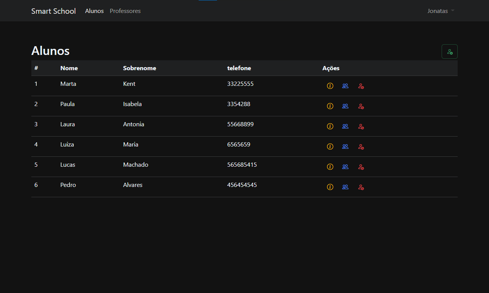
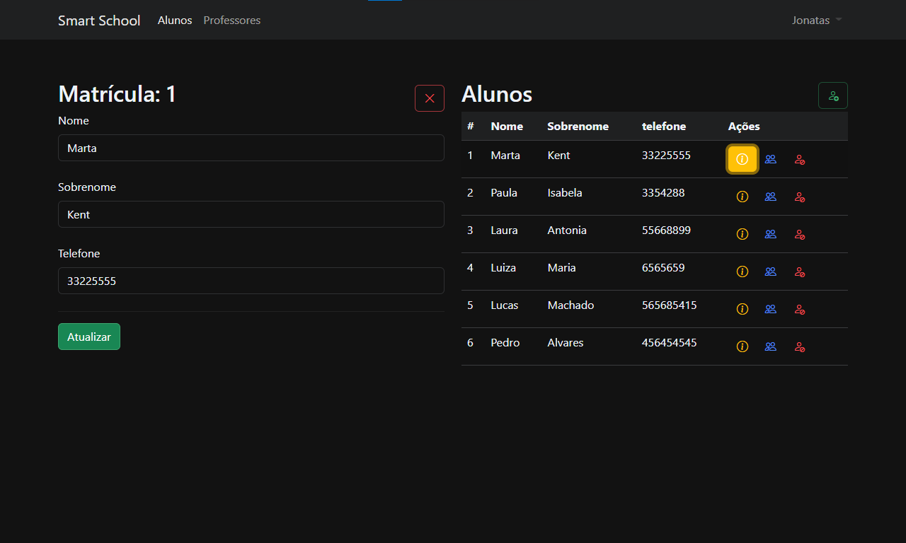
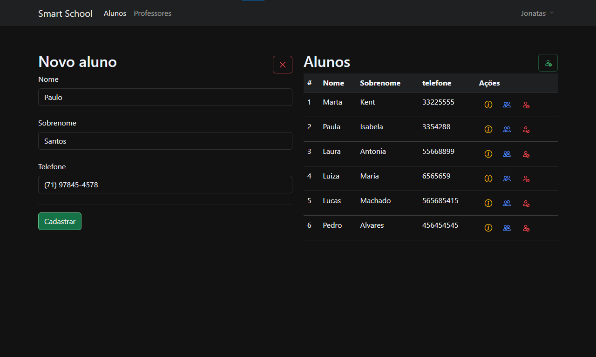
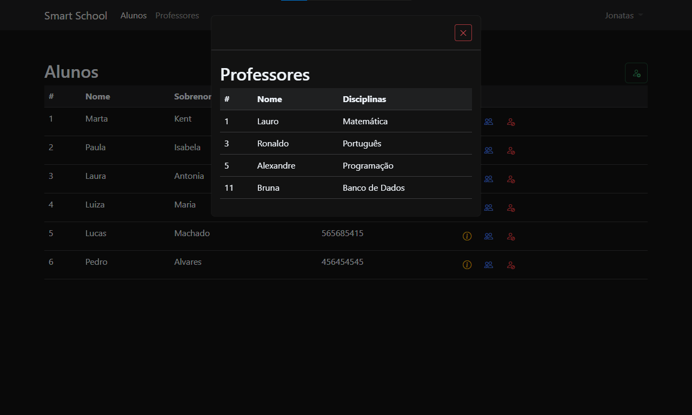
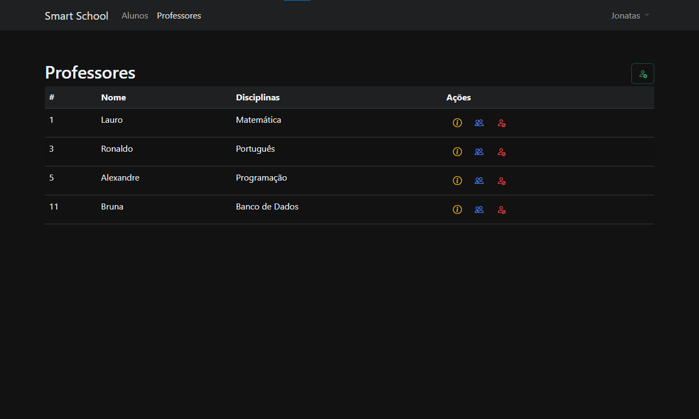
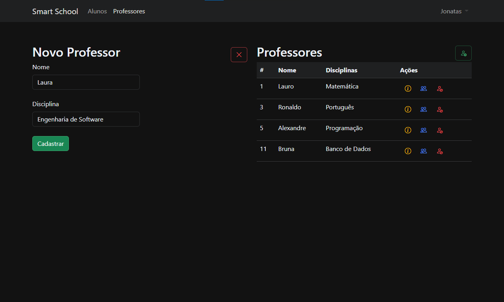
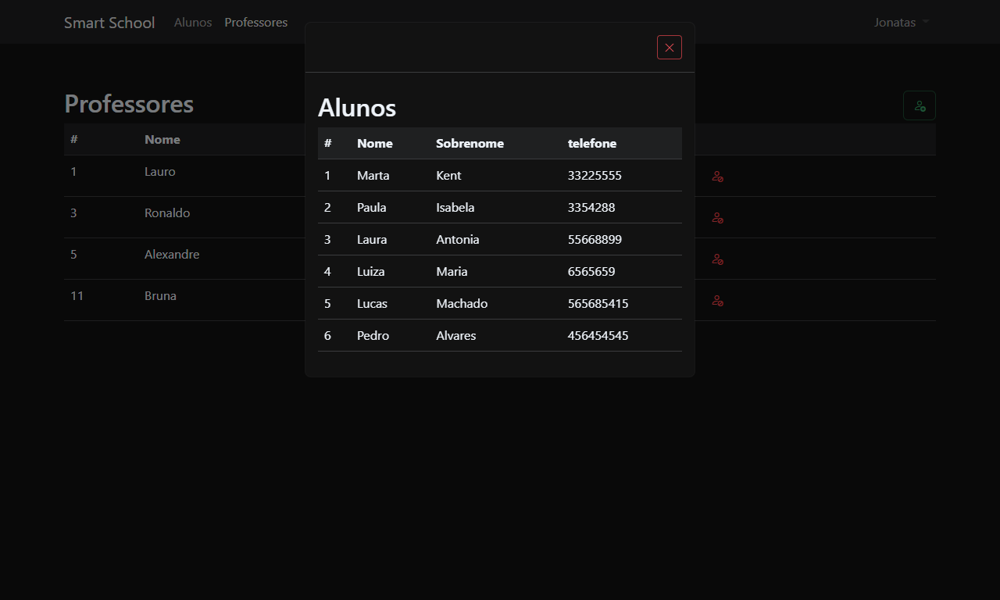

# Smart School

O Smart School é uma aplicação simples desenvolvida como resultado de estudos do framework [Angular](https://github.com/angular). O objtivo do App é exibir e permitir o cadastro de alunos e professores. Essa aplicação  utiliza um banco de dados local SQLite, por isso os dados cadastrados são salvos e obtidos através da API Rest desenvolvida em ASP.Net e Entity Framework.

## Features

• Cadastrar um aluno  
• Editar dados do aluno  
• Cadastrar um professor  
• Editar dados do professor  

## View screens

## Home Screen

## Student Screen

  

## Teacher Screen
  

## App

